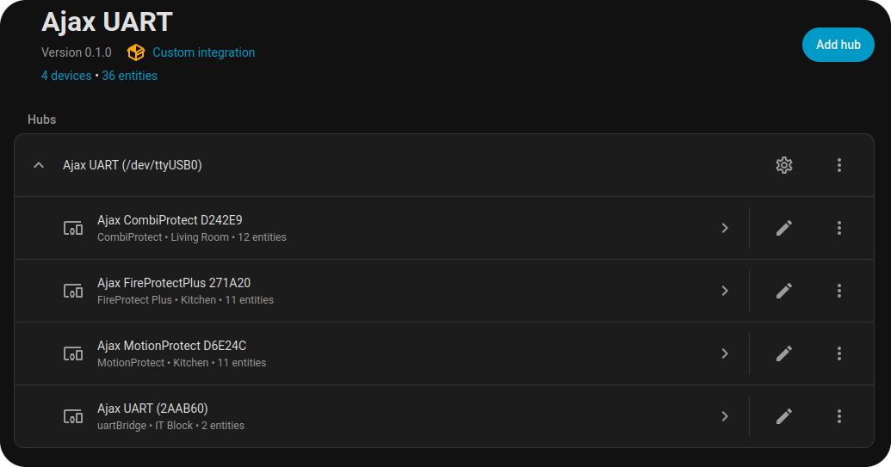
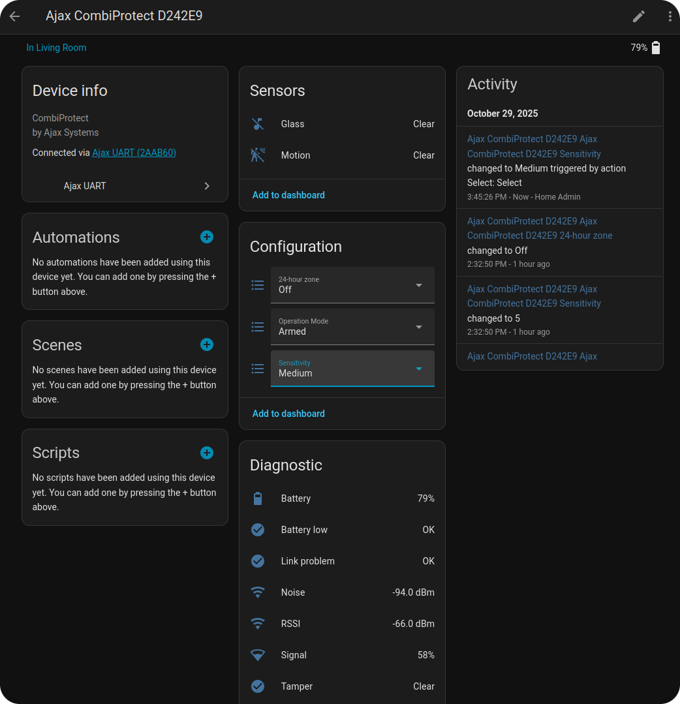
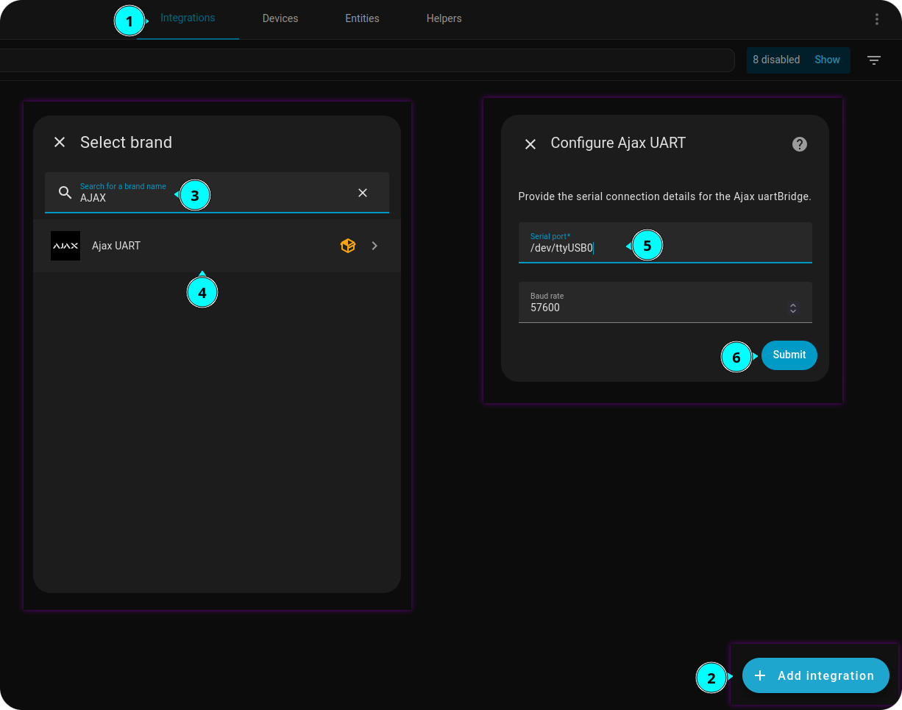
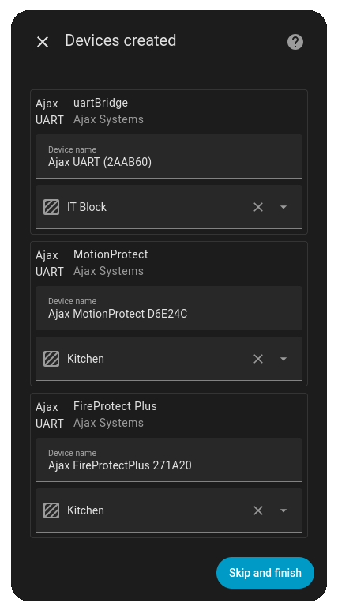
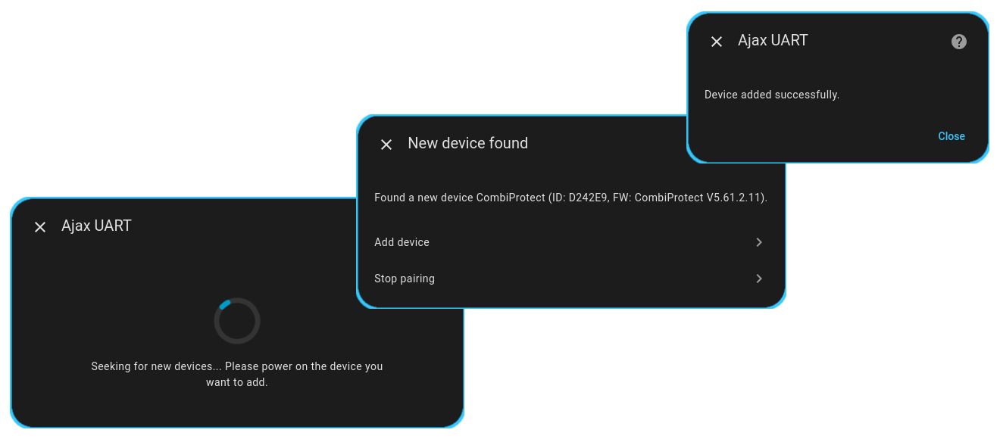
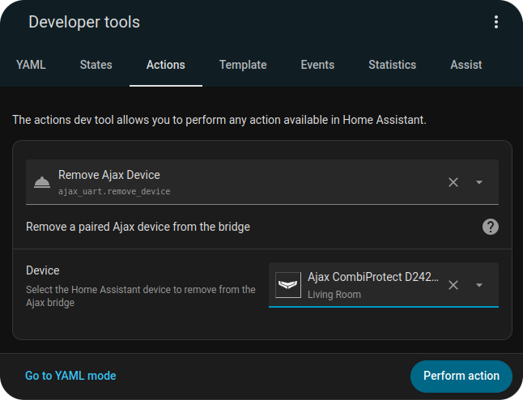

# Intro

> [!NOTE]
[uartBridge](https://ajax.systems/products/uartbridge/) — The receiver module for connecting [Ajax Systems](https://ajax.systems) detectors to wireless security systems and smart home solutions.

The UART integration module gives developers and integrators full control over integrating Ajax devices independently of external services and the internet connection, a vital feature for autonomous systems.

This extension allows easy configuration of the uartBridge and quickly adds supported Ajax devices with a couple of clicks.

> [!IMPORTANT]
> ℹ️ The extension is a pure vibe-coding product. I've just designed a data structure, entity representation, device management flow, and a basic functional.  
> ℹ️ As the vendor stopped producing uartBridge in 2023, I will not plan to improve the codebase.  
> ℹ️ Due to the vendor's refusal to provide per-device information on possible _setting types_ and _values _ that can be adjusted with _Byte1/Byte2_, I cannot create a correct settings mapping. That's why a primitive sensitivity setting is the only one available.  
> ℹ️ I can add more settings if I have enough information.

## Supported device list

* MotionProtect [✅Tested]
* MotionProtect Plus
* CombiProtect [✅Tested]
* DoorProtect
* FireProtect
* FireProtect Plus [✅Tested]
* LeaksProtect
* Ajax SpaceControl
* GlassProtect

## Features

* HUB (uartBridge)
  * Easy add/remove HUB entities
  * Support multiple HUBs
  * Automatic import of devices that are already paired with the uartBridge
  * Arm/Disarm system switch
  * Debug switch that allows you to turn on UART events in the HomeAssistant logs for debug purposes
* Devices
  * Easy add/remove devices (no QRs, turn on the device and add to the integration in two clicks)
  * Full-fledged entities set: Basic sensors + Diagnostic sensors:
    - Battery capacity
    - Battery warning
    - Link problem
    - Signal quality (+Noise +RSSI)
    - Tamper alarm
  * Configuration abilities:
    - 24-h zone
    - sensitivity (MotionProtect [+] and GlassProtect only)
  * Arm/Disarm per device switch

---

# Installing
## HACS
Ajax UART extension is available via The Home Assistant Community Store ([HACS](https://hacs.xyz/))

## Manual
Just put the `custom_components` directory into the configuration location (where `configuration.yaml` is typically located) and restart your HomeAssistant service.

---

# Configuring
## Add the integration (the first HUB device)
1. Go to **⚙️Settings ➡ Devices and Services ➡ Integrations** [`config/integrations/dashboard`]
2. Press **➕ Add integration**
3. Choose __Ajax UART__ extention in the list
4. Specify port of your uartBridge device (e.g., `/dev/ttyUSB0`) and press __Submit__
5. You can specify the Area for importing devices in the final dialog window.

## Add another HUB device
1. Go to **Ajax UART** integration section [`config/integrations/integration/ajax_uart`]
2. Press **Add hub**
3. Specify port of your uartBridge device (e.g., `/dev/ttyUSB1`) and press __Submit__

## Add Device
1. Go to the **Devices** section under the integration [`config/devices/dashboard?domain=ajax_uart`]
2. Press **➕ Add device**
3. Power on the device you want to pair, after the _Searching_ dialog appears.
4. Press **Add device** variant of the _New Device found_ dialog to finish the procedure.

## Remove device
The project doesn't involve frontend changes, so we use the devtool action:
1. Navigate to **🔨Developer tools ➡ Action** [`developer-tools/action`]
2. Find one **Remove Ajax Device** [`ajax_uart.remove_device`]
3. Select the device you want to remove from the drop-down list
4. Tap __Perform Action__

---
